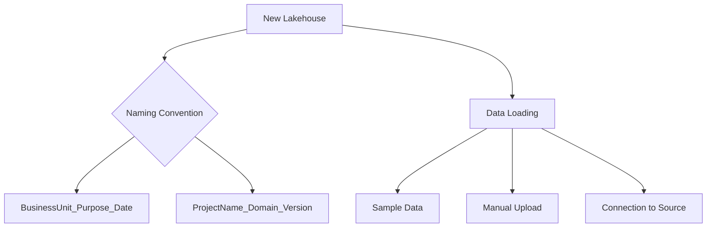
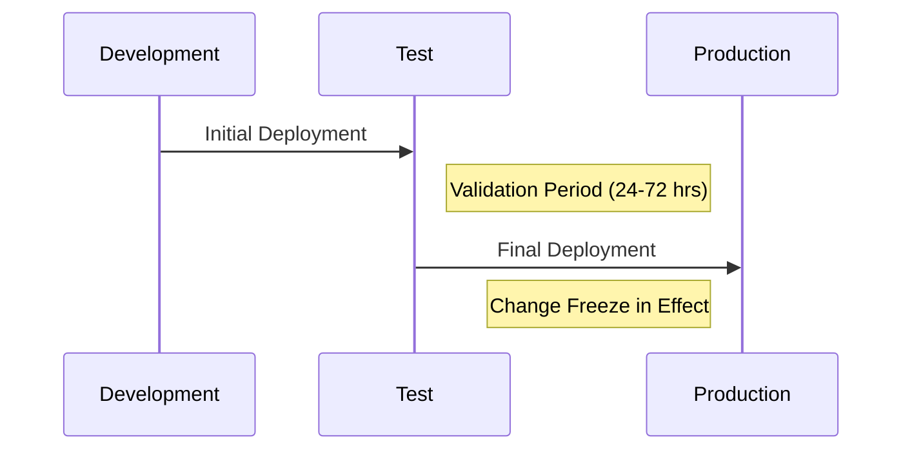
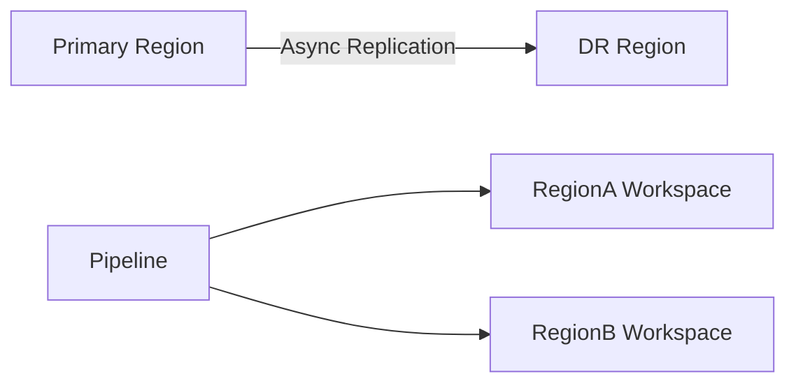

# **A Comprehensive Guide to Deployment Pipelines in Microsoft Fabric**  

Deployment pipelines in Microsoft Fabric provide a controlled, automated way to move analytics content—such as reports, datasets, and lakehouses—across different environments. This ensures that changes are properly developed, tested, and validated before reaching end users, minimizing errors and maintaining consistency.  

This guide provides a **step-by-step walkthrough** of setting up a deployment pipeline, assigning workspaces, creating and deploying content, and best practices for managing the process.  

---

## **Prerequisites**  
Before starting, ensure you have:  
✅ **Microsoft Fabric access** (with a valid license: Trial, Premium, or Fabric capacity)  
✅ **Workspace admin permissions** (to create and manage pipelines)  
✅ **Three dedicated workspaces** (Development, Test, Production)  

> **Note:** If you need help assigning roles, refer to Microsoft’s documentation:  
> [Roles in workspaces in Microsoft Fabric](https://learn.microsoft.com/en-us/fabric/get-started/roles-workspaces)  

---

## **Step 1: Create Dedicated Workspaces**  
Each stage of the deployment pipeline should have its own workspace to maintain separation of concerns.  

### **Steps to Create Workspaces:**  
1. Go to the [Microsoft Fabric homepage](https://app.fabric.microsoft.com) and sign in.  
2. Select **Workspaces** (🗇) from the left navigation pane.  
3. Click **New workspace** and create three workspaces with these names:  
   - **Development** (for building and modifying content)  
   - **Test** (for validation and user acceptance testing)  
   - **Production** (for final, user-ready content)  
4. Assign each workspace a **Fabric capacity** (Trial, Premium, or Fabric).  

> **Best Practice:**  
> - Use naming conventions like `[TeamName]_Dev`, `[TeamName]_Test`, `[TeamName]_Prod` for clarity.  
> - If workspace names are taken, append a unique identifier (e.g., `Development_Finance_001`).  

---
## **Step 2: Creating a Deployment Pipeline – In-Depth Guide**

A deployment pipeline in Microsoft Fabric serves as the backbone of your content release strategy, ensuring controlled movement of analytics assets between environments. This section provides a comprehensive breakdown of pipeline creation, configuration options, and architectural considerations.

### **Understanding Pipeline Architecture**

Microsoft Fabric deployment pipelines follow a **sequential stage model** with these key characteristics:
- **Linear progression**: Content typically flows from Development → Test → Production
- **Stage isolation**: Each environment maintains complete separation
- **Bidirectional comparison**: You can compare content across any two stages
- **Deployment history**: All deployments are logged for audit purposes

### **Detailed Creation Process**

1. **Accessing the Pipeline Interface**
   - Navigate to the Fabric portal (https://app.fabric.microsoft.com)
   - Select **Deployment Pipelines** from the left navigation pane
   - Click the **New pipeline** button in the top action bar

2. **Naming Conventions (Critical for Enterprise Use)**
   - Follow organizational naming standards (e.g., "Region_Department_Type_Pipeline")
   - Include version indicators for iterative improvements (v1, v2)
   - Example: "EMEA_Finance_Reports_Pipeline_v2"

3. **Stage Configuration Options**
   - **Default Setup**: Development → Test → Production (recommended for most cases)
   - **Custom Stages**: Add/remove stages as needed (e.g., UAT, Pre-Prod)
   - **Stage Naming**: Modify default names to match organizational terminology

4. **Advanced Settings**
   - **Deployment Rules**: Configure what content types can be deployed
   - **Approval Workflows**: Set up pre-deployment approvals (requires Power Automate integration)
   - **Notification Settings**: Enable email alerts for deployment events

### **Pipeline Visualization and Management**

Once created, the pipeline dashboard provides:
- **Stage Connection Status**: Visual indicators showing synchronization state
- **Content Inventory**: Drill-down view of assets in each stage
- **Deployment Controls**: One-click deployment between connected stages
- **Comparison Tools**: Side-by-side diff views of content versions

### **Enterprise Considerations**

For large organizations:
- **Pipeline Ownership**: Assign dedicated pipeline administrators
- **Security Model**: Configure RBAC for pipeline management
- **Capacity Allocation**: Assign different capacities to each stage
- **Disaster Recovery**: Implement pipeline backup strategies

### **Troubleshooting Creation Issues**

Common problems and solutions:
- **"Unable to create pipeline"**: Verify you have admin rights on all target workspaces
- **Missing stages**: Check your Fabric license tier (some restrict stage count)
- **Naming conflicts**: Ensure pipeline names are unique across the organization

### **Best Practices for Pipeline Design**

1. **Environment Parity**
   - Maintain identical configurations across all stage workspaces
   - Include capacity settings, security roles, and connection references

2. **Version Control Integration**
   - Connect pipelines to Azure Repos or GitHub
   - Implement branch-based deployment strategies

3. **Documentation Standards**
   - Maintain a pipeline manifest documenting:
     - Purpose and scope
     - Associated workspaces
     - Approval workflows
     - Ownership details

4. **Testing Framework**
   - Implement automated validation checks between stages
   - Include data freshness verification
   - Add performance benchmarking

### **Next Steps After Creation**

1. **Workspace Assignment** (covered in detail in Section 3)
2. **Initial Content Population**
3. **Pipeline Permissions Configuration**
4. **Monitoring Setup**

> **Why Use Default Stages?**  
> - **Development:** Where initial changes are made.  
> - **Test:** Where QA and stakeholders validate functionality.  
> - **Production:** Where finalized content is published for end users.  

---

## **Step 3: Assign Workspaces to Pipeline Stages**  
Each pipeline stage must be linked to its corresponding workspace.  

### **Steps to Assign Workspaces:**  
1. Open your newly created pipeline.  
2. For each stage (**Development**, **Test**, **Production**), click **Select workspace**.  
3. Choose the matching workspace:  
   - **Development stage** → **Development workspace**  
   - **Test stage** → **Test workspace**  
   - **Production stage** → **Production workspace**  
4. Confirm by clicking **Assign**.  

> **Validation Check:**  
> Ensure that the correct workspaces are assigned by reviewing the pipeline overview.  

---

## **Step 4: Create and Deploy Content**  
Now, you’ll create a sample lakehouse in the **Development** workspace and deploy it through the pipeline.  

---
This section provides an in-depth exploration of content creation and deployment workflows in Microsoft Fabric pipelines, covering practical implementation, advanced techniques, and enterprise-grade best practices.

### **Content Creation Fundamentals**

#### **1. Development Workspace Setup**
- **Environment Preparation**:
  - Verify workspace capacity allocation
  - Configure necessary data connections
  - Set up appropriate security roles
- **Content Types**:
  - Lakehouses (primary data storage)
  - Semantic models (Power BI datasets)
  - Reports (Power BI visualizations)
  - Dataflows (ETL pipelines)

#### **2. Lakehouse Creation Process**


**Detailed Steps**:
1. Navigate to Development workspace
2. Select "New" → "Lakehouse"
3. Apply naming convention (e.g., "Sales_Analytics_2024")
4. Configure:
   - Default file format (Delta recommended)
   - Partitioning strategy
   - Retention policies
5. Load initial data:
   - Sample datasets for testing
   - Production data connections
   - Manual CSV/Excel uploads

#### **3. Supporting Content Creation**
- **Semantic Models**:
  - Connect to lakehouse tables
  - Define relationships and measures
  - Configure refresh schedules
- **Reports**:
  - Build on semantic models
  - Implement organizational branding
  - Set up default filters

### **Deployment Methodology**

#### **1. Pre-Deployment Checks**
- **Validation Checklist**:
  - [ ] Content naming follows standards
  - [ ] All dependencies included
  - [ ] Data source connections validated
  - [ ] Performance benchmarks met
  - [ ] Documentation updated

- **Comparison Tools**:
  - Side-by-side asset comparison
  - Change impact analysis
  - Dependency mapping

#### **2. Deployment Execution**


**Detailed Workflow**:
1. Initiate deployment from pipeline interface
2. Select deployment scope:
   - Full content deployment
   - Selective asset deployment
3. Configure deployment options:
   - Overwrite existing content
   - Preserve historical data
   - Maintain security roles
4. Monitor real-time progress:
   - Success/failure notifications
   - Performance metrics
   - Resource utilization

#### **3. Post-Deployment Verification**
- **Automated Tests**:
  - Data completeness checks
  - Report rendering validation
  - Query performance testing
- **Manual Validation**:
  - Business user sign-off
  - UAT confirmation
  - Production smoke tests

### **Advanced Deployment Scenarios**

#### **1. Incremental Deployments**
- Delta deployments for large content
- Selective table updates
- Schema evolution handling

#### **2. Blue-Green Deployments**
1. Maintain parallel production environments
2. Route traffic between versions
3. Implement instant rollback capability

#### **3. Hotfix Procedures**
- Emergency deployment protocols
- Bypass testing for critical fixes
- Post-deployment validation requirements

### **Enterprise Deployment Patterns**

#### **1. Cross-Region Deployment**


#### **2. Multi-Tenant Deployments**
- Tenant-specific content filtering
- Shared deployment pipeline
- Isolated security contexts

#### **3. Regulatory Compliance**
- Deployment audit trails
- Change approval documentation
- SOX-compliant release processes

### **Troubleshooting Deployments**

**Common Issues and Solutions**:

| Issue | Root Cause | Resolution |
|-------|-----------|------------|
| Missing dependencies | Improper content selection | Use "Show dependencies" feature |
| Permission errors | Target workspace restrictions | Verify contributor rights |
| Schema conflicts | Diverged table definitions | Schema reconciliation tools |
| Performance degradation | Unoptimized queries | Pre-deployment query tuning |

### **Performance Optimization**

1. **Deployment Packaging**:
   - Compress large artifacts
   - Parallelize asset deployment
   - Batch similar content types

2. **Network Considerations**:
   - Bandwidth requirements
   - Geographic proximity
   - Private endpoint configuration

3. **Scheduling Strategies**:
   - Off-peak deployment windows
   - Maintenance period alignment
   - Business cycle considerations

### **Best Practices Checklist**

- [ ] Implement deployment runbooks
- [ ] Maintain staging documentation
- [ ] Version all pipeline changes
- [ ] Monitor deployment metrics
- [ ] Conduct periodic deployment drills

This comprehensive content deployment methodology ensures reliable, efficient movement of analytics assets through your Fabric environments while maintaining enterprise-grade controls and visibility. Would you like me to elaborate on any specific deployment scenario or technical aspect?

> **Key Observations:**  
> - A **green checkmark (✔)** indicates successful synchronization between stages.  
> - An **orange warning (⚠)** means there are pending changes to deploy.  

---

## **Step 5: Managing Deployments and Best Practices**  

### **1. Comparing Changes Before Deployment**  
- Always use the **Compare** feature to review differences between stages.  
- This helps catch unintended changes before they reach production.  

### **2. Handling Deployment Failures**  
- If a deployment fails, check:  
  - **Permissions** (Does the target workspace have the right access?)  
  - **Dependencies** (Are all required datasets and reports included?)  
  - **Conflicts** (Does the target workspace already have conflicting content?)  

### **3. Automating Deployments (Advanced)**  
- Use **PowerShell** or **Fabric REST APIs** to automate deployments in CI/CD workflows.  
- Example:  
  ```powershell
  # Sample PowerShell script for deployment
  Invoke-FabricDeployment -Pipeline "Sales_Analytics_Pipeline" -SourceStage "Test" -TargetStage "Production"
  ```

### **4. Rollback Strategy**  
- If a bad deployment reaches production:  
  - **Option 1:** Redeploy the last known good version.  
  - **Option 2:** Use Fabric’s version history to restore previous content.  

---

## **Step 6: Clean Up (Optional)**  
If this was a training exercise, clean up unused workspaces to avoid clutter.  

### **Steps to Remove Workspaces:**  
1. Go to **Workspaces** and select each workspace (Dev, Test, Prod).  
2. Click **Workspace settings** > **Remove this workspace**.  
3. Confirm deletion.  

---

## **Final Thoughts**  
Deployment pipelines in Microsoft Fabric bring **structure, reliability, and automation** to analytics development. By following this guide, you ensure:  
✔ **Consistency** across environments  
✔ **Reduced risk** of errors in production  
✔ **Efficient collaboration** between teams  

For deeper learning, explore:  
- [Microsoft’s Deployment Pipelines Documentation](https://learn.microsoft.com/en-us/fabric/cicd/deployment-pipelines/)  
- [Advanced CI/CD with Fabric and Azure DevOps](https://learn.microsoft.com/en-us/fabric/cicd/continuous-integration-delivery)  

**Next Steps:**  
- Try deploying a **Power BI report** through the pipeline.  
- Experiment with **branching strategies** for larger teams.  
